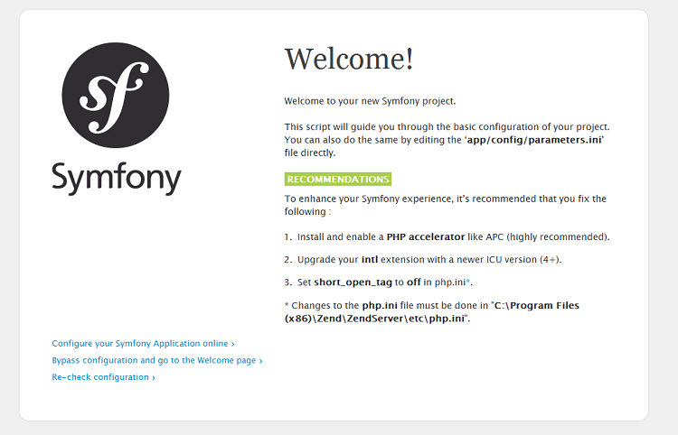

Snapsell web service
====================

This project is a web services developed in PHP5 / Symfony which manages products published by users and 
and purchase requests .

Installing
----------

To test the Web service must download it from bitbuckets repository .These instructions show you how to clone your repository using Git from the terminal.

1. Navigate to the repository in Bitbucket (https://bitbucket.org/mostaqlvip/snapsellwebservice).
2. Click the Clone button.
3. Copy the clone command (either the SSH format or the HTTPS).
If you are using the SSH protocol, ensure your public key is in Bitbucket and loaded on the local system to which you are cloning.
4. Launch a terminal window.
5. Change to the local directory where you want to clone your repository.
6. Paste the command you copied from Bitbucket (git clone https://zaroui@bitbucket.org/mostaqlvip/snapsellwebservice.git)

Testing 
-------

### Prerequisities

- Install wampserver from http://www.wampserver.com/#download-wrapper this will give you a server on your own PC.
- Install PhpStorm or any IDE for consulting the code.
- Install composer from https://getcomposer.org/download/
- Add DHC Rest client plugin to chrome navigator from this link :
    https://chrome.google.com/webstore/detail/dhc-rest-client/aejoelaoggembcahagimdiliamlcdmfm?hl=fr
    
### Steps to runnig the snapsell admin panel in localhost 

- Copy and paste the project folder in www directory of wamp server (the full path in my case is "C:\wamp\www" ).
- Go to path/to/project
- To install all project dependency lunch a terminal window and execute
   `` composer install ``
- run wamp server.
- Now to create the data base you must execute the command :
   `` php bin/console doctrine:database:create  ``
- To create data base tables execute
    `` php bin/console doctrine:schema:update --force ``
- To create an admin for the admin control execude
    `` php app/console doctrine:fixtures:load ``

- Now you can open your browser and navigate to ``localhost/snapsellwebservice/web/login `` and use admin as value for both username and admin fields to connect.

### Steps to test the snapsell api 

#### Tools

- Header creator for wsse useful for testing : http://www.teria.com/~koseki/tools/wssegen/
- DHC Rest client useful for testing REST with WSSE protection .
- Online base64 encoder useful for encode the username before generate the header : https://www.base64encode.org/

#### Test API access via WSSE 

To test the API you must 

1. encode the username(admin) to the base64 with the online encoder. 
2. generate the header with http://www.teria.com/~koseki/tools/wssegen/ (“auto nonce”, “auto date”. no “before wsse”. “User = [username in the database encoded in base64]“, “password = [password in database]).
3. send it to the server (You can begin with create a new user )

Example of header :
    UsernameToken Username="2KfYqNmIINmF2YbZitix", PasswordDigest="PqDwgwQsDgrsfo26Ll9jLPYcIl4=", Nonce="MTBmYmZiM2YwMjBkNzhhNQ==", Created="2016-09-27T16:55:09Z"

## Deployment

The methodology is as follows:

1. Upload your code to the production server;
2. Install your vendor dependencies (typically done via Composer and may be done before uploading);
3. Running database migrations or similar tasks to update any changed data structures;
4. Clearing (and optionally, warming up) your cache.

### Compatibility check

Obviously, to deploy a Symfony application on your server, it is still necessary that it be compatible with the needs of Symfony.
To verify this, we can distinguish two cases.

#### You already have a web host :

This case is easiest because you have access to the server. Symfony integrates a small PHP file that does all the necessary compatibility checks, use it! This is the `` web / config.php ``file, but before sending it to the server we need to modify a little bit. Indeed, open it, you can see that there is a condition on the IP

    
        // …
            <?php
                // web/config.php
                
                
            if (!in_array(@$_SERVER['REMOTE_ADDR'], array(
              '127.0.0.1',
              '::1',
            ))) {
              header('HTTP/1.0 403 Forbidden');
              exit('This script is only accessible from localhost.');
            }
    
   Simply delete this block and send the file to your server. Open the web page that corresponds, for example `` www.your-server.com/config.php ``. You should get the following figure :
  
   
  
   If you have that matches your server is compatible with Symfony, because there is no party "Major Problems" just "Recommendations".

#### You don't have a hosting and looking for compatible one :

   It does not matter, you'll do it by hand! Below is the list of required requirements.
                                           
   * PHP needs to be a minimum version of PHP 5.5.9
   * JSON needs to be enabled
   * ctype needs to be enabled
   * Your php.ini needs to have the date.timezone setting
   * The date.timezone setting must be set in php.ini.
   
### Upload the code : send files to the server via FTP

1. First make sure you clear your Symfony cache: to do that execute 
    `` php bin/console cache:clear --env=prod --no-debug ``
2. Install/Update your Vendors
    `` composer install ``
3. Upload all project directory to the server with FTP client 
4. Set rights to the  ``/var`` directory :
   Symfony needs to write in  ``/var`` directory the application cache and improve performance.Normally, your FTP client should allow you to set folder permissions. With FileZilla for example, right-click on ``var `` folder allows you to define the rights;Be sure to grant all rights (777).
5. Allow the development environment
   To run Symfony commands, including those to create the database, we need to have access to the development environment.To do that open ``web/app_dev.php`` you can see that there is a condition on the IP :
   
           // …
               <?php
               // web/app_dev.php
               
               // …
               
               if (!in_array(@$_SERVER['REMOTE_ADDR'], array(
                 '127.0.0.1',
                 '::1',
                 '123.456.789.1'
               ))) {
                 header('HTTP/1.0 403 Forbidden');
                 exit('You are not allowed to access this file. Check '.basename(__FILE__).' for more information.');
               }
      This time, do not delete the condition, you need access to the development environment in the future. This requires that you complete the condition with your IP address.

6. Set up the database
   Configure your  `` app/config/parameters.yml `` file to adapt the right values of `` database_* `` parameters.
                 
                      database_host: your hoste
                      database_port: port value
                      database_name: snapsell
                      database_user: user
                      database_password: password
                      
      and execute  `` php bin/console doctrine:database:create `` then  `` php bin/console doctrine:schema:update --force `` 

7. Execute `` php app/console doctrine:fixtures:load `` to insert a new user (Admin) in users table with admin value for both username and password fields.
8. Go to `` app/config/config.yml `` and put the real path to your site as value for ``media_web_path`` .
                      
                     media_web_path: 'http://yoursite.com/web/uploads/media'

####That's it, your site should be operational now!